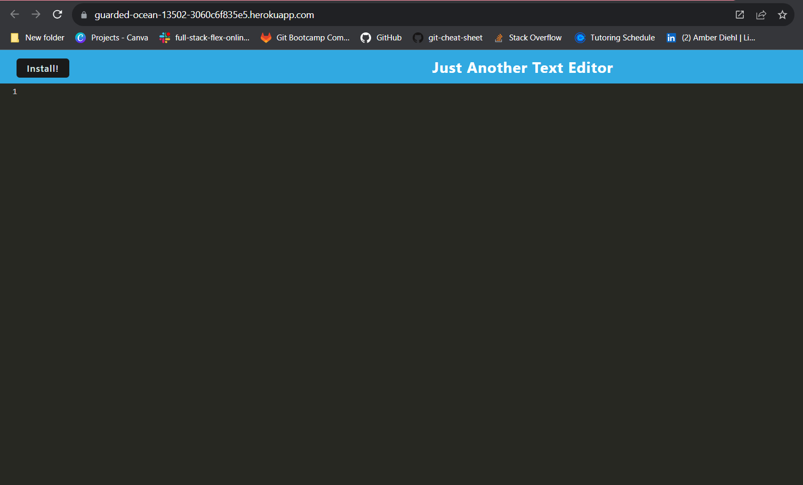

# Text_Editing_Helper

## Description
Provide a short description explaining the what, why, and how of your project. Use the following questions as a guide:
- What was your motivation?
  - To practice my new found knowledge of Progressive Web APplication (PWA) and create a text editor tool.
- Why did you build this project? 
  - I wanted to create a text editor tool that is utilized in the web browser.
- What problem does it solve?
  - 
- What did you learn?

## Installation
What are the steps required to install your project? Provide a step-by-step description of how to get the development environment running.
- Create a github repo with a unique name
- Clone the https github repo URL into git using the git clone function
- Type in "code ." into git once the repo is saved on your computer
- VSCode will pop up onto your desktop and within VSCode you have the ability to edit and save committed material within VSCode.
- This is communicating with Git when you are complete with changes utilize "git add ." to sync all changes
- Use "git commit -m "enter commit messages" to commit the changes into git
- Use "git push origin main" as the final push into github where you will see all of your saved changes and a copy of the code.

## Usage
Provide instructions and examples for use. Include screenshots as needed.

Heroku: https://guarded-ocean-13502-3060c6f835e5.herokuapp.com/

To add a screenshot, create an `assets/images` folder in your repository and upload your screenshot to it. Then, using the relative filepath, add it to your README using the following syntax:

md

